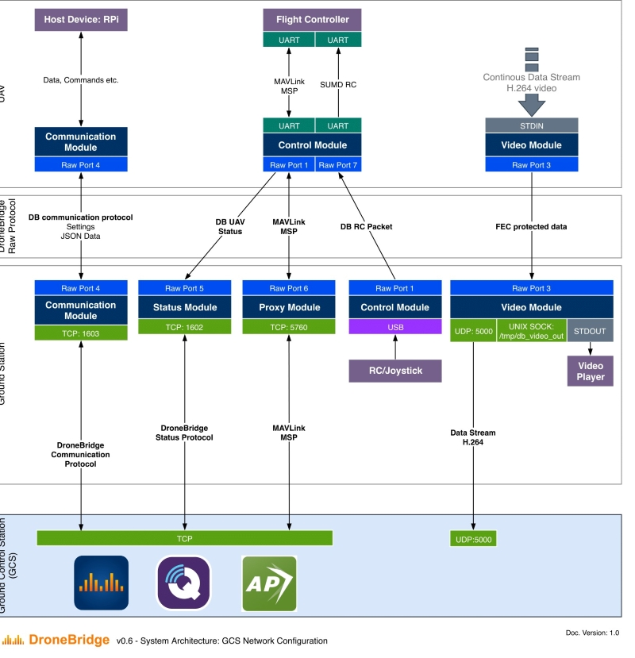

# DroneBridge

DroneBridge is a system based on the
[WifiBroadcast](https://befinitiv.wordpress.com/wifibroadcast-analog-like-transmission-of-live-video-data/) approach.
A bidirectional digital radio link between two endpoints is established using standard WiFi hardware and a custom protocol.
DroneBridge is optimized for use in UAV applications and is a complete system. It is intended be a real alternative to
other similar systems, such as DJI Lightbridge or OcuSync.

DroneBridge features support for **Raspberry Pi**, **ESP32** on the UAV/ground station side and an **android app**.

Visit **["Not just another drone project"](http://wolfgangchristl.de/not-just-another-drone-project/)** for additional information about the project and its goals

## Releases
Please read the **[getting started guide](https://dronebridge.gitbook.io/docs/dronebridge-for-raspberry-pi/getting-started)**
The v0.6 release is recommended since v0.5 is deprecated.

**Disclaimer: Use at your own risk. Malfunction and sudden signal loss can not be ruled out. Use with caution! Do not fly over people or animals.  
The user is responsible for:**
  - **Operating the system within legal limits (e. g. frequency, equivalent isotropically radiated power (EIRP) etc.)**
  - **Any harm or damage caused by using the provided software or parts of it.**

### v0.6 Alpha
Use with caution. Image and RC link is not field tested.  
**[DroneBridge Alpha v0.6 Image for Raspberry Pi](https://forstudents-my.sharepoint.com/:u:/g/personal/ga25puh_forstudents_onmicrosoft_com/EZah1nq0VhNKtHNdDhQNh5QBtVIsj1dOsqOnqJYzGeuN8w?e=S7vCbh)**  
**[DroneBridge for Android 2.0.0](https://forstudents-my.sharepoint.com/:u:/g/personal/ga25puh_forstudents_onmicrosoft_com/EXD5MF2nbNFCi-Il9mXa3BYBsaoM-qJ_wcLUDPZtBczBgg?e=vbPGt7)**

### v0.5 Beta (deprecated)
**[DroneBridge Beta v0.5 Image for Raspberry Pi](https://github.com/DroneBridge/DroneBridge/releases/tag/v0.5)**  
**[DroneBridge for Android 1.2.4](https://forstudents-my.sharepoint.com/:u:/g/personal/ga25puh_forstudents_onmicrosoft_com/EQbZxsMUfNlAjZPnomlmrWoBNFWIhT7CH0ta5qYIaH849A?e=EAKmUo)**

## One System. One digital radio link to rule them all.

* **300 m - 14+ km range*** (500 m - 2 km with standard hardware)
* **1080p video**
* **110ms glass to glass latency** (using android app)
* **Cheap**: starting at 80€ for hardware
* **12 channel RC**
* **MAVLink support** - LTM telemetry deprecated. Use with mwptools, QGroundControl, Mission Planner etc.
* **iNAV** & **MAVLink** based flight controller support
* **Bidirectional**
* Fully integrated **app for Android**
* **OSD**
* **Modular - Write your own powerful plugins**

*Range strongly depends on your setup, environment and legal framework.

## DroneBridge for Android

* Easy to use UI & end point of the whole DroneBridge system
* Low latency video decoding
* Change settings, calibrate the RC, view telemetry

**[Learn more about the app](https://dronebridge.gitbook.io/docs/dronebridge-for-android/dronebridge-for-android)**

## Exemplary hardware setup
DroneBridge is available for the Raspberry Pi & ESP32 (no video, telemetry only - WiFi based)
By compiling the libraries on your Linux computer any device can become an AIR or GND unit. This means DroneBridge is not restricted to the Raspberry Pi.  
However many single board computers do not offer the same kind of stability and hardware/software support as the Raspberry Pi (camera, H.264 en-/decoding etc.).

### Raspberry Pi/Linux (Long Range Setup)

### DroneBridge for ESP32
For further information have a look at the [DB for ESP32 main page](https://github.com/DroneBridge/ESP32)

## DroneBridge Modules

DroneBridge is highly modularized to provide flexebility and make development easy. There is a common library for Python 3 and C/C++ that handles everything involving the DroneBridge raw protocol. 
It configures the sockets, inits the protocol and provides methods for easy transmission.  
Instead of the Android app any other GCS can be used.

[Read more in the Wiki](https://dronebridge.gitbook.io/docs/developer-guide/dronebridge-lib-example-usage)

## System Architecture

[Read more in the wiki](https://dronebridge.gitbook.io/docs/developer-guide/system-architecture)

## Coming Up:
 - More documentation
 - Add MavLink and MSP waypoint missions editor to Android App
 - DroneBridge Cockpit: A client/OS for x86 systems to monitor and control your UAV
 - See **[milestones](https://dronebridge.gitbook.io/docs/dronebridge-for-raspberry-pi/milestones)**

## You are a developer?
Check out the **[wiki](https://dronebridge.gitbook.io/docs/)**  
Check out the **[milestones](https://dronebridge.gitbook.io/docs/dronebridge-for-raspberry-pi/milestones)** and suggest new ones!  
Join the **[Gitter room](https://gitter.im/DroneBridge/Lobby?utm_source=share-link&utm_medium=link&utm_campaign=share-link)** and discuss issues, ask questions or give feedback  

There is a nightly branch with the most up to date code! It is not guaranteed that the code in that branch is working or even compiling!

**Feel free to ask questions & contribute**

## Licenses

 * All of the code (especially DroneBridge modules & lib_dbcommon - C or Python) is under the Apache 2 license if not specified otherwise
 * WifiBroadcast legacy code (video, OSD, .profile, hello_video) is licensed as specified or under the GPL v2 license
 * All Kernel drivers/patches are under GPL v2 license
